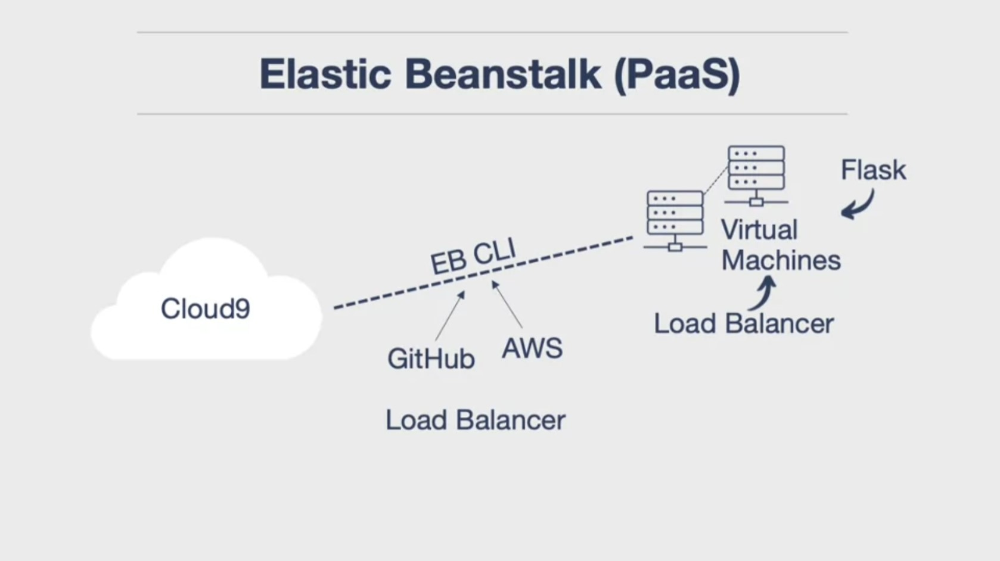

# aws-elastic-beanstalk
A continuous delivery pipeline to auto-deploy a Flask web application on AWS Elastic Benstalk.



1. Install EB CLI dependencies in an AWS Cloud9 envrionment: 

```
sudo yum groupinstall -y "Development Tools"
```
```
sudo yum install -y zlib-devel openssl-devel ncurses-devel libffi-devel sqlite-devel.x86_64 readline-devel.x86_64 bzip2-devel.x86_64
```

2. Install EB CLI:

```
git clone https://github.com/aws/aws-elastic-beanstalk-cli-setup.git
```
```
./aws-elastic-beanstalk-cli-setup/scripts/bundled_installer
```

3. Ensure `eb` is in PATH:

```
echo 'export PATH="/home/ec2-user/.ebcli-virtual-env/executables:$PATH"' >> ~/.bash_profile && source ~/.bash_profile
```
```
eb --version
```

4. Clone this GitHub repo, and cd into the directory:

```
git clone https://github.com/ptdriscoll/aws-elastic-beanstalk.git
```
```
cd aws-elastic-beanstalk
```

5. Create and source the Python virtual environment:

```
python3 -m venv ~/.venv
```
```
source ~/.venv/bin/activate
```

6. Install packages:

```
make all
```

7. If you have never set up an Elastic Beanstalk app in your AWS account:
    - Some IAM roles need to be created with the correct permissions
    - The easiest way to do that is to first create a sample app through the console:
	    - [Creating an Elastic Beanstalk environment](https://docs.aws.amazon.com/elasticbeanstalk/latest/dg/using-features.environments.html)
		- [Unable to assume role [IAM Role ARM] Verify that the role exists](https://forums.aws.amazon.com/thread.jspa?threadID=213002)
	- Once created, the roles will be referenced by future Elastic Beanstalk apps		

8. Initialize eb app:

```
eb init -p python-3.7 flask-continuous-delivery
```

9. As an option, to create SSH keys, run `eb init` again.

10. Create an environment and deploy:

```
eb create flask-continuous-delivery-env
```

11. To terminate environment, and all related AWS resources:

```
eb terminate flask-continuous-delivery-env
```

### Video tutorial

- [Building a Website using PaaS with AWS Beanstalk](https://www.coursera.org/lecture/cloud-computing-foundations-duke/building-a-website-using-paas-with-aws-beanstalk-qKLVW)

### More references

- [Building Multiple Types of Websites](https://paiml.com/docs/home/books/cloud-computing-for-data/chapter02-cloud-foundations/#building-multiple-types-of-websites)
- [Deploying a Flask application to Elastic Beanstalk](https://docs.aws.amazon.com/elasticbeanstalk/latest/dg/create-deploy-python-flask.html)
- [GitHub: Flask-Elastic-Beanstalk](https://github.com/noahgift/Flask-Elastic-Beanstalk)
- [Install the EB CLI](https://docs.aws.amazon.com/elasticbeanstalk/latest/dg/eb-cli3-install.html)
- [GitHub: EB CLI Installer](https://github.com/aws/aws-elastic-beanstalk-cli-setup)
- [AWS Elastic Beanstalk Documentation](https://docs.aws.amazon.com/elastic-beanstalk/index.html)
- [AWS CodeBuild Documentation](https://docs.aws.amazon.com/codebuild/index.html)
